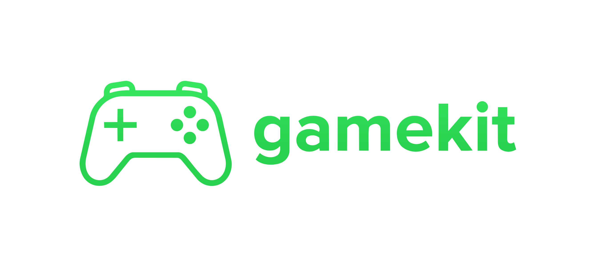

<div align="center">


[](https://discord.gg/jmJkNbwxYc)
[](LICENSE)
</div>

##
gamekit is an open-source CLI that connects Claude Code directly to the Unity Editor. No MCP server, no third-party relay -- just a lightweight Unity plugin and a set of commands that give Claude full control over the development loop.

Write code, compile, see errors, fix them, enter play mode, take screenshots, build -- all without leaving Claude Code.

Join our [Discord](https://discord.gg/jmJkNbwxYc) and help us build! Have feature requests? [Suggest here](https://github.com/gamekit-agent/gamekit-cli/issues).

## Quick Start

**Prerequisites:** [Unity Hub](https://unity.com/download) with Unity 6 or 2022.x, and [Claude Code](https://docs.anthropic.com/en/docs/claude-code)

**Install:**

macOS / Linux / WSL
```bash
curl -fsSL https://github.com/gamekit-agent/gamekit-cli/releases/latest/download/install.sh | bash
```
Windows PowerShell
```
irm https://github.com/gamekit-agent/gamekit-cli/releases/latest/download/install.ps1 | iex
```

**Set up a project:**
```bash
gamekit init
```
This walks you through creating a new Unity project (or adding gamekit to an existing one). It installs the Unity Editor plugin into `Assets/Editor/GameKit/` and sets up Claude commands and skills in `.claude/`.


## Testing the Setup

Once `gamekit init` completes and Unity opens the project:

**1. Verify the connection**
```bash
gamekit doctor
```
This checks that Unity is running, the plugin is loaded, and the HTTP bridge is healthy. All 5 checks should pass.

**2. Try the core loop**
```bash
# Trigger recompilation after editing C# files
gamekit refresh

# Read Unity console output
gamekit console
gamekit console --errors
gamekit console --follow    # live stream

# Control play mode
gamekit play start
gamekit play status
gamekit play stop
```

**3. Inspect and modify the scene**
```bash
# See what's in the scene
gamekit hierarchy
gamekit inspect Main\ Camera

# Create and manipulate GameObjects
gamekit create Cube --parent Environment
gamekit add-component Cube MeshRenderer
gamekit transform Cube --position 0,3,0
gamekit set Cube Transform localScale 2,2,2

# Clean up
gamekit destroy Cube
```

**4. Screenshots and builds**
```bash
# Capture what Unity sees
gamekit screenshot
gamekit screenshot --scene
gamekit screenshot --camera MainCamera

# Build the project
gamekit build --platform win
gamekit test
```

**5. Asset management**
```bash
# Prefabs
gamekit prefab create Player
gamekit prefab instantiate Assets/Prefabs/Player.prefab
gamekit prefab overrides Player

# Materials
gamekit material create RedMetal --shader Standard
gamekit material set Assets/Materials/RedMetal.mat _Color 1,0,0,1
gamekit material assign Assets/Materials/RedMetal.mat Cube

# Animator info
gamekit animator list Assets/Animations/PlayerController.controller
```

**6. Input simulation (in play mode)**
```bash
gamekit input key space                    # Tap a key
gamekit input key w --hold 0.5             # Hold a key
gamekit input mouse left --at 400,300      # Click at position
```

## How It Works

gamekit installs a lightweight C# Editor plugin into your Unity project. The plugin runs an HTTP server on localhost (port range 17580-17589) that exposes Unity Editor APIs. The CLI sends requests to this server.

```
Claude Code  -->  gamekit CLI  -->  HTTP  -->  Unity Editor Plugin  -->  Unity API
```

- The plugin starts automatically when Unity opens the project
- Connection info is stored in `.gamekit/server.json`
- All scene modifications are undoable (Ctrl+Z in Unity)
- Claude writes C# files directly; gamekit handles Unity-specific operations (compile, screenshot, scene manipulation, play mode, etc.)

## Commands

| Command | What it does |
|---------|--------------|
| `gamekit init` | Interactive project setup -- creates project, installs plugin and Claude config |
| `gamekit doctor` | Diagnose setup issues and verify Unity connection |
| `gamekit refresh` | Trigger recompilation, return structured errors |
| `gamekit console` | Read Unity logs (--errors, --warnings, --follow) |
| `gamekit play` | Start, stop, and query play mode |
| `gamekit screenshot` | Capture Game view, Scene view, or specific cameras |
| `gamekit scene` | List and open scenes |
| `gamekit hierarchy` | Query scene hierarchy as JSON tree |
| `gamekit inspect` | Inspect GameObject components and properties |
| `gamekit create` | Create GameObjects in the scene |
| `gamekit destroy` | Remove GameObjects from the scene |
| `gamekit transform` | Set position, rotation, scale |
| `gamekit add-component` | Add components to GameObjects |
| `gamekit set` | Set property values on components |
| `gamekit list` | List project assets (scripts, scenes, prefabs) |
| `gamekit settings` | Show project settings (layers, tags, physics, quality, input) |
| `gamekit build` | Trigger builds for target platforms |
| `gamekit test` | Run Unity Test Framework tests |
| `gamekit prefab` | Create, instantiate, and query prefab overrides |
| `gamekit material` | Create materials, set properties, assign to renderers |
| `gamekit animator` | Query Animator controller states and transitions |
| `gamekit input` | Simulate keyboard and mouse input during play mode |

All commands output JSON to stdout and human-readable text to stderr. Use `--json` to force JSON output.

## Who it's for

- **New to Unity** -- Go from idea to playable prototype fast. Describe what you want, iterate on it, learn by doing.
- **Experienced teams** -- Accelerate the parts Claude is good at: systems code, state machines, networking, UI logic, NPC behavior.
- **Multiplayer game devs** -- Claude is excellent at writing multiplayer code and test suites.

## Demos

### Create game prototypes quickly
<div align="center">

<p align="center"><em>/new-game Create a mini golf game with 3 holes.</em></p><br><br>
</div>

<div align="center">

<p align="center"><em>/new-game Create a Minecraft-style voxel world.</em></p><br><br>
</div>

### Add multiplayer to your game
<div align="center">

<p align="center"><em>/add-multiplayer</em></p><br><br>
</div>

## Documentation

- [Commands](docs/commands.md): Full CLI reference
- [Slash Commands](docs/slash-commands.md): Claude slash commands for game development
- [Project Structure](docs/project-structure.md): What gamekit creates
- [How It Works](docs/how-it-works.md): Architecture and plugin integration
- [Troubleshooting](docs/troubleshooting.md): Common issues and fixes

## License

MIT

Created by the team at [Normal](https://normcore.io/).
